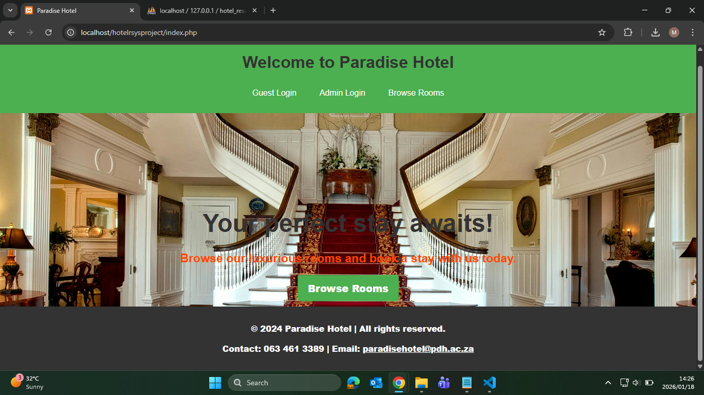
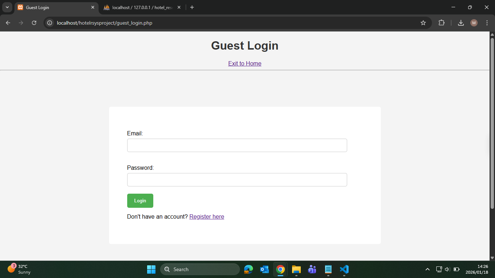
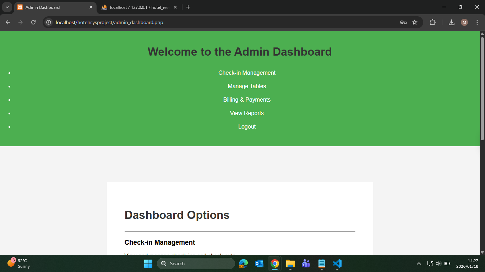
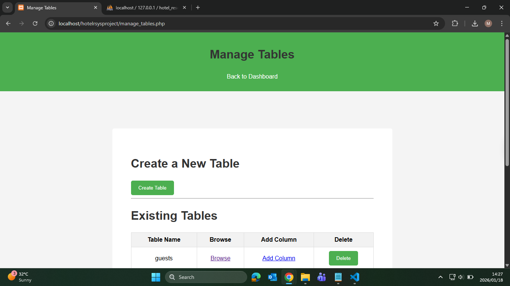
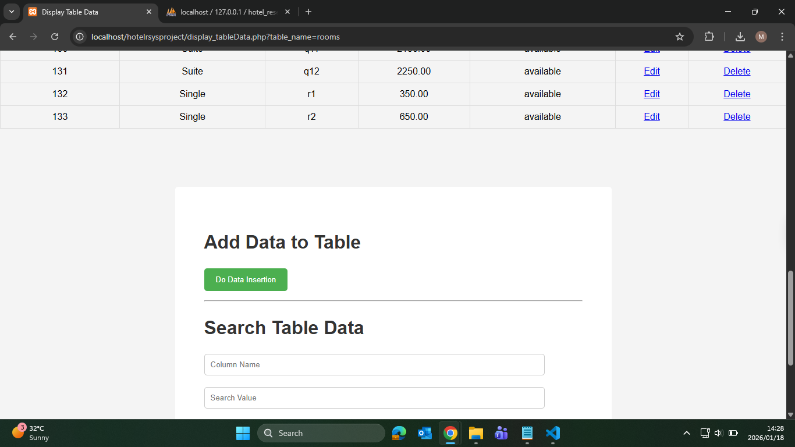

# Hotel Reservation System

A full-stack web-based Hotel Reservation System developed using PHP and MySQL.
The system allows management of hotel rooms, bookings, and customer records through a database-driven interface.

This project was developed as part of an academic database and systems analysis project.

---

# 🛠️ Technologies Used

⦁	Backend: PHP
⦁	Frontend: HTML, CSS, JavaScript
⦁	Database: MySQL
⦁	Server Environment: XAMPP (Apache & MySQL)
⦁	Code Editor: Visual Studio Code

---

# ✨ Features

⦁	Hotel room and booking management
⦁	Customer reservation records
⦁	Database-driven CRUD operations
⦁	Relational database design with normalization
⦁	Simple and user-friendly web interface

---

# 📊 Database Design

⦁	Relational database schema
⦁	Normalized to Third Normal Form (3NF)
⦁	Designed to reduce redundancy and improve data integrity
---

# 📂 Project Setup (XAMPP)

## Prerequisites

Ensure you have the following installed:

* XAMPP
* Web browser (Chrome, Edge)

---

### Installation Steps

1. Download or clone the project

   * Download the project from GitHub

2. Move project folder

   * Copy the project folder (`hotelrsysproject`)
   * Paste it into:

     ```
     C:\xampp\htdocs\
     ```

3. Start XAMPP

   * Open XAMPP Control Panel
   * Start Apache
   * Start MySQL

4. Create the database

   * Open browser and go to:

     ```
     http://localhost/phpmyadmin
     ```
   * Create a new database (hotel_reservation_system`)
   * run the queries on file `sql queries.txt` so as to create the base tables for the systems

5. Configure database connection

   * Open the PHP database configuration file
   * Update credentials if needed:

     ```php
     $host = "localhost";
     $user = "root";
     $password = "";
     $database = "hotel_reservation_system";
     ```

6. Run the application

   * Open your browser and navigate to:

     ```
     http://localhost/hotelrsysproject/index.php
     ```

---

## 🎓 Academic Context

This system was developed as part of a Database Systems and Systems Analysis project to demonstrate:

⦁	Requirement analysis
⦁	Database design and normalization
⦁	Backend and frontend integration
⦁	Practical application of SQL and PHP

---

## 🚀 Future Improvements

⦁	Improved UI/UX design
⦁	Reporting and analytics dashboards
⦁	Booking availability optimization

---

# 👤 Author

Moses Mmakola
BSc Mathematical & Computer Sciences
Sol Plaatje University

⦁	GitHub: https://github.com/mosesmmakola
⦁	LinkedIn: https://www.linkedin.com/in/moses-mmakola-9a08bb378

---







